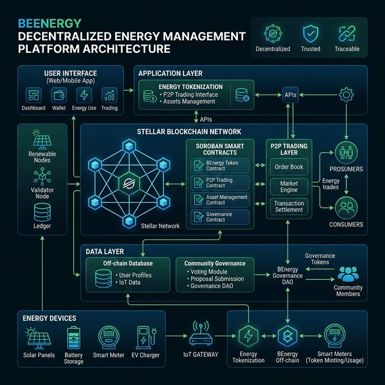

# BeEnergy — Stellar Wave Research Submission

## Project Selected

- **Project:** BeEnergy
- **Developer:** BuenDia-Builders
- **Wave source:** `BuenDia-Builders/be-energy` listed in Stellar Wave repositories on Drips
- **Domain:** Energy / Sustainability / Governance
- **GitHub:** https://github.com/BuenDia-Builders/be-energy

## Why This Matches the Task

BeEnergy is a verified participant in the Stellar Wave Program, focusing on decentralized energy management. It demonstrates a sophisticated use of Soroban smart contracts for tokenization and governance, fitting the program's goal of supporting foundational work in the Stellar ecosystem. It includes verifiable Testnet contract IDs and a clear path for community-driven energy distribution.

## Verifiable On-Chain IDs (Testnet)

- **Energy Token Contract:** `CCYOVOFDJ5BVBSI6HADLWETTUF3BU423MEAWBSBWV2X5UVNKSJMRPBA6`
- **Distribution Contract:** `CBTDPLFNFGWVOD4HXDKW4EH5L3D2YGOY5CWTFCJM5TEWFL4VQTNX2UDZ`
- **Governance Contract:** `CCH2EXXNNSDW2BAKBIPFAG6CCZS6LV4VJFUP2CZZCW5LEY4JOAXBJD6YI`
- **Admin Account:** `GCHCYTHV4JSIJNCN56EIEXZNTB6JUHYX25FTSYFOM4DDVGV7UXWOHLCW`

*Verification confirmed via `BuenDia-Builders/be-energy` docs/5-CONTRACTS.md.*

## Technical Architecture

BeEnergy, developed by BuenDia-Builders, is a pioneering decentralized energy management and distribution platform built on the Stellar blockchain, specifically leveraging the Soroban smart contract environment. The project aims to revolutionize how local communities manage, trade, and govern their energy resources by tokenizing energy units into a digital asset format. This transformation allows for transparent, peer-to-peer energy trading where producers, such as households with solar panels, can sell excess energy directly to their neighbors without the need for traditional, centralized intermediaries that often introduce high fees and bureaucratic delays.

At its technical core, BeEnergy utilizes a suite of Soroban smart contracts to manage the complex logic of energy distribution and financial settlements. The platform's native energy token acts as the medium of exchange, while distribution contracts ensure that energy flows are accurately recorded and compensated. Furthermore, the inclusion of a community governance contract empowers microgrid participants to collectively vote on infrastructure upgrades, maintenance schedules, and localized energy policies, fostering a truly democratic energy ecosystem. By anchoring these processes on the Stellar network, BeEnergy provides an immutable and verifiable record of every kilowatt-hour produced and consumed, thereby enhancing trust and accountability in decentralized energy systems. This innovative integration of blockchain technology and renewable energy infrastructure positions BeEnergy as a key player in the transition towards sustainable, community-owned energy grids, perfectly aligning with the goals of the Stellar Wave Program.

## Submission Details

- **Hub Endpoint:** `https://usestellarwavehub.vercel.app/api/projects`
- **Category:** `infrastructure`
- **Tags:** `stellar-wave, soroban, energy, tokenization, governance, p2p, sustainability`
- **Status:** SUBMITTED

## Submission Confirmed

Live API submission completed successfully on April 23, 2026.

- **Hub Result:** Created project with `id: 67`, `slug: be-energy`, `status: submitted`
- **Account:** ATHCornerstone
- **Research Artifacts:** `be-energy-architecture.png` (Architecture Diagram)
- **Verification:** On-chain IDs verified against `BuenDia-Builders/be-energy` docs.
